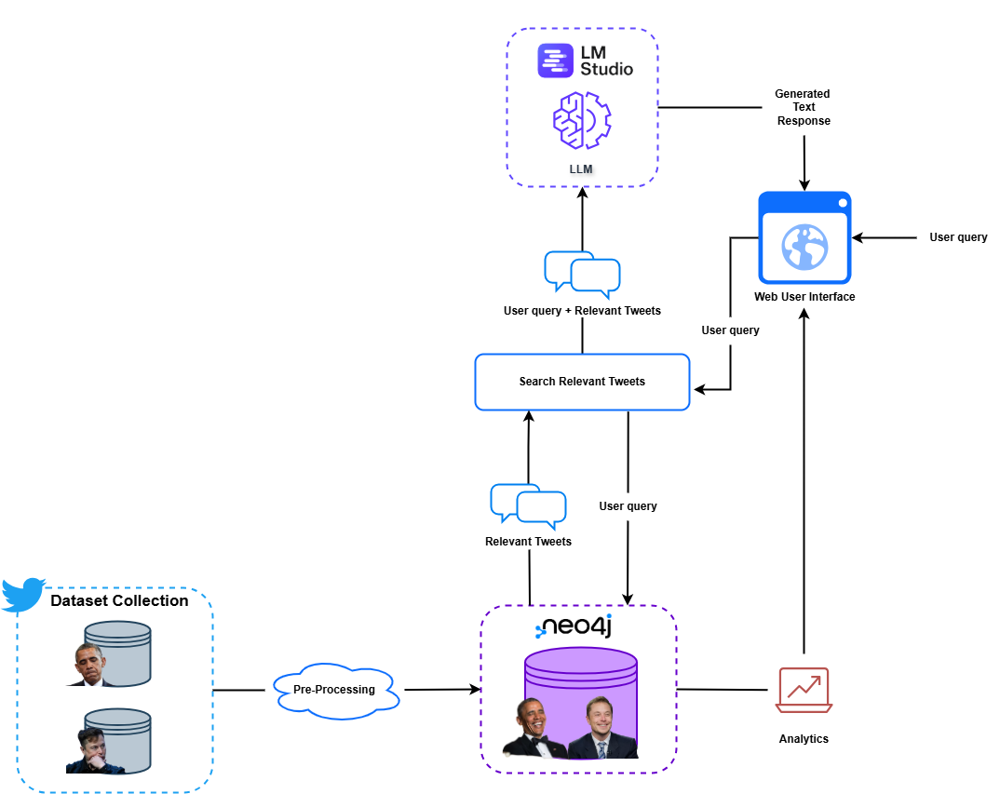

# 🧠 Big Data Project: LLM-Based Personality Inference

This project aims to infer user personality traits from social media content (tweets), using Named Entity Recognition, Topic Classification, and an LLM for reasoning.  
It is designed to run entirely locally, leveraging **LM Studio** for inference, a local **Neo4j** database for storage, and a **React + Vite** frontend for user interaction.


---
## ⛓️ Pipeline Schema



## 📁 Project Structure
```
BigDataProject/
├── backend/
│   ├── main.py
│   ├── schemas.py
│   ├── neo4j_connector.py
│   └── services/
│       ├── tweet_analysis.py
│       └── topic_extraction.py
├── frontend/
│   ├── index.html
│   ├── package.json
│   ├── package-lock.json
│   ├── public/
│   │   └── (static assets, e.g. favicon, images)
│   └── src/
│       ├── main.jsx
│       ├── App.jsx
│       └── components/
│           └── (React components)
├── .gitignore
├── requirements.txt
├── setup.sh
└── README.md
```

## ⚙️ Setup Instructions

### 1. Create a Conda Environment
Make sure you have Conda installed. Then create an environment with **Python 3.11 or higher**:
```bash
conda create -n myenv python=3.11
conda activate myenv
```

### 2. Create a Conda Environment
Open the `setup.sh` file and modify the line:
```
CONDA_ENV_NAME="myenv"
```
Replace `myenv` with the name of your newly created environment. Then execute the script:

```
chmod +x setup.sh
./setup.sh
```
This will:

- Install Python dependencies from `requirements.txt`
- Download the `en_core_web_trf` spaCy model
- Install frontend dependencies via `npm install` inside the `frontend` folder

### 3. Setup Neo4j and Load the Dataset
- Start a Neo4j Desktop or Docker instance and create a new **DBMS**
- Inside the Neo4j browser, upload the dataset using:
    - dataset: `utils/dataset.csv`
    - cypher script: `utils/cypher_create_dataset.txt`
### 4. Create a `.env` file
Create a `.env` file with the following content:
```
NEO4J_URI=bolt://localhost:7687
NEO4J_USERNAME=neo4j
NEO4J_PASSWORD=your_password
```
### 5. Download LM Studio and the LLM
Download [LM Studio](https://lmstudio.ai/) and load the model:
- **Model**: llama-3.1-8b-instruct (GGUF version, quantized if needed)
- Other models may also be used, provided they support chat-style prompting.

## 🚀 Running the Project

### 1. Activate the Conda Environment
```
conda activate myenv
```
### 2. Start the Neo4j DBMS
Ensure your Neo4j database is running.

### 3. Start LM Studio Server
In LM Studio:
- Load the `llama-3.1-8b-instruct` model
- Enable the **local server**
- Set the server port (e.g., `http://localhost:1234`)

### 4. Launch the Backend
```
cd backend
python -m uvicorn main:app --reload
```

### 5. Launch the Frontend
```
cd frontend
npm run dev
```
